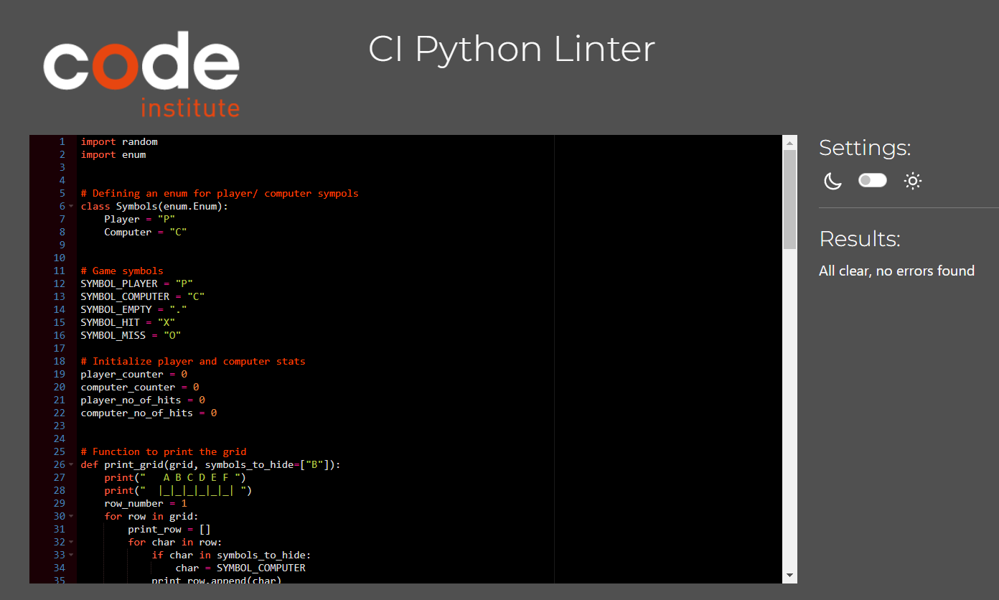

# Battleship Game!

This is a digital version of the classic and beloved board game Battleship! The original game is often 
enjoyed by two people sitting opposite each other as they attempt to destroy the other person's 
fleet. It's an intense and exciting game that normally cannot be played without a partner. With this 
digital version of the game players will be able to play at a moment's notice no matter where they are as long 
as they have a smart device to connect them to the internet. They will no longer have to wait for a partner to enjoy the 
game as they will be able to play online against the computer, and have the same excitement. This new revised version of battleship 
follows the same rules as the original, the user will play against the computer, they will each have 4 ships place randomly 
on the grid and will take turns attacking eachother until one fleet is completeley destroyed. 

## Features

* ### The Grid 
* The grid is a 6x6 square, giving the players plenty of space to set up their flee.
* The rows are are labled from 1 to 6 for clarity and ease of use.
* The columns are labeled A to F in order to give the 6x6 space, and are seperated by the pipe (|) symbol for readability.
* Each player has 4 ships placed on their grids. The computer's ships are hidden, and the player's ships are represented by the letter "P".
* The grid size was originally 10x10, with 5 ships per player. This version of the game was too long as there is no limit to how many turns each player has.

 

* When the game starts, the player is instructed to enter a position on the grid, and given an input example (A5).

* When a player successfully hits the opponent's ship, the "X" symbol will be displayed, and the player's hits are counted above the grid.

* Similarly, when the player misses a ship, the "O" symbol will be displayed, and the player will receive a message saying "You Missed!".

* If a player repeats an input, they will be informed that they've already attacked that area, and told to try a different input.

* If the input is completely invalid, the player will be informed of the error, and receive an example for an appropriate input (A5).

* ### Future Features
* In the next version of the game, I would like to allow two players to play through seperate computers.
* In order to make the game more competitive, I can limit the amount of turns each player has. Then the game can end once one or both players are out of turns.
* The player(s) can enter their names at the start of the game, so each board and each turn is addressed to the player's name.
* Some ships can be larger than 1 cell. 

## Gameplay  

* ### The Rules
* The player will not be able to see where the opponent's ships are placed.
* They will be prompted to pick a row and a column.
* For the row the player must enter a number between 1 and 6, and a letter between A and F for the column.
* After the user takes a turn they will receive feedback to let them know if they hit or missed.
* The player wins once all 4 battleships are sunk.
* The first one to sink 4 ships will win the game.
* The user has unlimited turns. 

## Player Interaction 
  
* ### The Feedback  
* At each turn the player will be informed about the outcome of the choices made in the game.
* If a player places an invalid input, the game will let them know that it's not valid, and ask them to try again.
* They will also be informed if they've added an input that they've previously written, and be asked to place a new one.
* When the player misses a shot, they will receive a message to let them know, and the area where they missed will be marked with a. "O".
* When a player makes a successful hit, they will receive a message, and that area will be marked with an "X".
* When all ships are sunk, they will receive the message"Well Done! You've sunk your opponent's battleships. You Win!".

## Testing 

* ### Pep8
* Testing through pep8 returned no errors after after fixing all indentations and syntax.

##Bugs
* The only bug remainign, is that the invalid input response for when the user enters an input that doesn't exist doesn't display.

## Deployment 

* ### Steps
* This project was built and deployed using Code Institute's Heroku Terminal.
* I created a new Heroku application.
* I made sure the Config Vars settings were done according to the requirements.
* I connected the github repository to the Heroku app.
* I successfully committed the changes from gitpod to the repository.
* The app was successfully deployed on Heroku. 
  

## Credit

* ### Content
* The layout of the game is fairly simple, I looked at some online examples, the first one from this [Website](https://copyassignment.com/battleship-game-code-in-python/)
* From this site I was able to see the basic and simple layout of the grid.
* I originally planned to allow the user to choose the grid size, but I wasn't able to figure out the right methods to make it work.
* I give credit to my mentor Sandeep for showing me how to simplify everything, and use basic funstions for each step.
* The majority of my project was done by following my mentor's example for how to outline each function before writing the code.
* My fellow students on Stack were a great help when I wasn't sure about something. 
* The tutors helped me with any debugging that I could not figure out on my own. 
